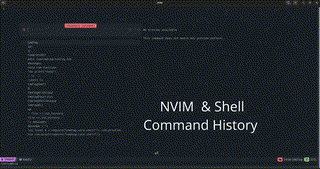

```
 ██████╗███╗   ███╗██████╗ ██╗      ██████╗  ██████╗
██╔════╝████╗ ████║██╔══██╗██║     ██╔═══██╗██╔════╝
██║     ██╔████╔██║██║  ██║██║     ██║   ██║██║  ███╗
██║     ██║╚██╔╝██║██║  ██║██║     ██║   ██║██║   ██║
╚██████╗██║ ╚═╝ ██║██████╔╝███████╗╚██████╔╝╚██████╔╝
 ╚═════╝╚═╝     ╚═╝╚═════╝ ╚══════╝ ╚═════╝  ╚═════╝
                                            .nvim
```


> **Pairs well with [filetree.nvim](https://github.com/StefanBartl/filetree.nvim)** — cmdlog.nvim gives you fast recall of past `:` and shell commands, filetree.nvim gives you adapter-agnostic file-tree actions. Together they cover command reuse and file navigation in one consistent style.

🔧 Beta stage – under active development. Changes possible. Expect bugs, especially with the history feature on windows systems.

A lightweight, modern Neovim plugin to interactively view, search, and reuse command-line mode (`:`) history and shell history using Telescope (standard) ord fzf.

---

- [Features](#features)
- [Installation (with Lazy.nvim)](#installation-with-lazynvim)
  - [Load immediately](#load-immediately-recommended-for-most-setups)
  - [Load lazily (alternative)](#load-lazily-alternative)
    - [Option 1: Lazy-load on demand (command)](#option-1-lazy-load-on-demand-command)
    - [Option 2: Lazy-load via keybindings](#option-2-lazy-load-via-keybindings)
    - [Option 3: Lazy-load on specific event](#option-3-lazy-load-on-specific-event)
- [Installation (other package managers)](#installation-other-package-managers)
- [Dependencies](#dependencies)
- [Picker configuration (Telescope vs FzfLua)](#picker-configuration-telescope-vs-fzflua)
  - [When to use which picker?](#when-to-use-which-picker)
- [Usage](#usage)
  - [Cmdlog Picker Demo](#cmdlog-picker-demo)
  - [Command Syntax](#command-syntax)
  - [Commands](#commands)
  - [Shortcuts (inside pickers)](#shortcuts-inside-pickers)
- [Development](#development)
- [Disclaimer](#disclaimer)
- [Feedback](#feedback)

---

## Features


- **Interactive command history listing**: View and search through your `:` command history interactively using [Telescope.nvim](https://github.com/nvim-telescope/telescope.nvim).

- **Shell History Integration**: In addition to the standard Neovim command history, shell history for various supported shells is also included, such as:
  - `zsh`: `~/.zsh_history`
  - `bash`: `~/.bash_history`
  - `fish`: `~/.local/share/fish/fish_history`
  - `nu`: `~/.config/nushell/history.txt`
  - `ksh`: `~/.ksh_history`
  - `csh`: `~/.history`
  - pwsh  %APPDATA%\Microsoft\Windows\PowerShell\PSReadLine\ConsoleHost_history.txt

- **Picker Backend Options**: Choose between [Telescope.nvim](https://github.com/nvim-telescope/telescope.nvim) or [fzf-lua](https://github.com/ibhagwan/fzf-lua) for the picker backend, depending on your preference.

- **Favorites Management**: Mark and manage favorite commands with ease. Your favorites are saved in the `~/.local/share/cmdlog/favorites.json` file for easy access.

- **Command Execution**: Select an entry from the history to insert it into the command-line (without auto-execution), giving you control over your workflow.

- **Command Previews**: Preview the output of various commands directly within the picker (Telescope only). Currently supported preview types include:
  - **`:edit <file>`**: Shows the file preview if the file is readable.
  - **`:!<shell>`**: Simulates shell command output for supported shell commands.
  - **`:term[inal] [cmd]`**: Runs `cmd` and shows its output, or notes that no static preview exists for a bare `:term`.
  - **`:help <topic>`**: Renders the help page via a headless Neovim instance.
  - **`:lua <expr>`**: Evaluates the expression in-process and shows the result.

- **Project-Based History**: `:Cmdlog project` shows command history recorded while working inside the current Git project (`.git` root). Recording starts once the plugin is set up — pre-existing history isn't retroactively attributed to a project.

- **Lua-Mode History**: `:Cmdlog lua` shows only `:lua`/`:lua=`/`:=` command history.

- **Usage Stats**: `:Cmdlog stats` shows commands sorted by usage frequency, annotated with how many times and when they were last used.

- **Known-Error Highlighting**: Commands whose last run set a Vim error message are flagged with a marker and highlight in the picker (Telescope only).

- **Favorite Tags**: Tag favorites with free-form labels (`<C-t>` in the picker) to organize them beyond a flat list.

- **which-key Integration**: Pass a `keymaps` table to `setup()` to register normal-mode keymaps for any `:Cmdlog` subcommand; descriptions show up in [which-key.nvim](https://github.com/folke/which-key.nvim) automatically when it's installed.

- **Custom Pickers**: Developers and users can easily create their own custom pickers. A utility file, `picker_utils.lua`, abstracts much of the configuration, making it simple to extend the functionality. Comprehensive documentation on how to create and add custom pickers is available in the `/docs/` directory.

- **Configurable & which-key aware keymaps**: Picker keymaps (`<CR>`, `<Tab>`, `<C-r>`) can be remapped or disabled, and optional normal-mode entry-point keymaps for every `:Cmdlog*` command can be enabled — each carries a `desc`, so [which-key.nvim](https://github.com/folke/which-key.nvim) picks it up automatically. See [BINDINGS.md](./docs/BINDINGS.md).

- **`:checkhealth cmdlog`**: Verifies dependencies (telescope/fzf-lua), shell-history detection, and notes directory.

- **Delete single history entries**: Press `<C-x>` (configurable) inside a picker to delete the selected command from its underlying history — Neovim `:` history via `histdel()`, or the shell history file (with a confirmation prompt, since that rewrites a file on disk).

- **Error-prone command highlighting**: Commands matching a configurable list of risky patterns (`rm -rf`, `git reset --hard`, `git push --force`, `:qa!`, ...) are highlighted with `CmdlogRiskyCommand` so you notice them before reusing them. Configurable/disableable via `risky_patterns` / `highlight_risky`.

- **Project-based favorites** *(opt-in)*: Set `project_scoped.enabled = true` to keep a separate favorites file per Git project instead of one global file. Off by default — existing favorites are unaffected.

- **Privacy filter**: Commands matching a configurable list of `redact_patterns` (`password`, `secret`, `token`, `Bearer`, `api[-_]?key` by default) are never recorded to project history, stats, or the error log — those files are plaintext on disk. Set `redact_patterns = false` to disable.

- **`extra_files`**: Fold your own plain-text command files into the pickers as additional read-only history sources — see [OPTIONS.md](./docs/OPTIONS.md).

- **Origin labels**: The combined pickers (`:Cmdlog`, `:Cmdlog full`) label each non-favorite entry `nvim`/`shell`/`extra` by where it came from, and insert a `── nvim history ──`-style divider row before each origin block so the boundaries are visible at a glance (Telescope only; see [docs/FEATURES/PICKER.md](./docs/FEATURES/PICKER.md)).

- **Favorite Notes**: Attach a short note to a favorite via `vim.ui.input()` (`<C-e>`), separate from the full per-command notes side window — peek it in a floating popup with `<C-g>`. See [docs/FEATURES/FAVORITES.md](./docs/FEATURES/FAVORITES.md).

- **Cycle between pickers**: Press `<C-s>` (configurable) inside any picker to rotate to the next one (nvim → shell → favorites → project → …), keeping the current prompt text (Telescope only).

- **Favorites undo & manual reordering**: `<C-z>` undoes the last favorite toggle; `<C-Up>`/`<C-Down>` in the favorites picker reorder entries manually.

- **Favorites export/import**: `:Cmdlog export [path]` / `:Cmdlog import path` back up favorites to JSON or migrate them between machines.


---

## Installation (with Lazy.nvim)

You can install `cmdlog.nvim` like this:

### Load immediately (recommended for most setups)

This ensures `:Cmdlog` and all its subcommands (`:Cmdlog favorites`, etc.) are available without delay.

```lua
{
  "StefanBartl/cmdlog.nvim",
  lazy = false,
  dependencies = {
    "StefanBartl/lib.nvim",          -- Required: the :Cmdlog command layer is built on it
    "nvim-telescope/telescope.nvim", -- Required if you use picker = "telescope"
    "ibhagwan/fzf-lua",              -- Required if you use picker = "fzf"
  },
  config = function()
    require("cmdlog").setup({
      picker = "telescope",  -- or "fzf"
    })
  end,
}
```

### Load lazily (alternative)

You can also lazy-load the plugin if you prefer:

#### Option 1: Lazy-load on demand (command)

```lua
{
  "StefanBartl/cmdlog.nvim",
  lazy = true,
  cmd = { "Cmdlog" },
  dependencies = {
    "StefanBartl/lib.nvim",
    "nvim-telescope/telescope.nvim",
    "ibhagwan/fzf-lua",
  },
  config = function()
    require("cmdlog").setup({
      picker = "fzf", -- or "telescope"
    })
  end,
}
```

> **Note**: All seven pickers live under the single `:Cmdlog` command now
> (`:Cmdlog`, `:Cmdlog favorites`, `:Cmdlog nvim`, ...), so `cmd = { "Cmdlog" }`
> covers every one of them for lazy-loading — no need to list each variant.

#### Option 2: Lazy-load via keybindings

```lua
{
  "StefanBartl/cmdlog.nvim",
  lazy = true,
  keys = {
    { "<leader>cl", "<cmd>Cmdlog<CR>", desc = "Show command history" },
    { "<leader>cf", "<cmd>Cmdlog favorites<CR>", desc = "Show favorites" },
  },
  dependencies = {
    "StefanBartl/lib.nvim",
    "nvim-telescope/telescope.nvim",
    "ibhagwan/fzf-lua",
  },
  config = function()
    require("cmdlog").setup({
      picker = "telescope",
    })
  end,
}
```

---

#### Option 3: Lazy-load on specific event

```lua
{
  "StefanBartl/cmdlog.nvim",
  lazy = true,
  event = "VeryLazy", -- or e.g. "BufReadPost"
  dependencies = {
    "StefanBartl/lib.nvim",
    "nvim-telescope/telescope.nvim",
  },
  config = function()
    require("cmdlog").setup({
      picker = "telescope", -- or "fzf"
    })
  end,
}
```

Note: If you lazy-load the plugin, make sure to define how it should be triggered (`cmd`, `keys`, `event`, etc.), otherwise commands like `:Cmdlog` won’t be available.

---

## Installation (other package managers)

### packer.nvim

```lua
use({
  "StefanBartl/cmdlog.nvim",
  requires = {
    "StefanBartl/lib.nvim",
    "nvim-telescope/telescope.nvim", -- or "ibhagwan/fzf-lua"
  },
  config = function()
    require("cmdlog").setup({ picker = "telescope" })
  end,
})
```

### vim-plug

```vim
Plug 'StefanBartl/lib.nvim'
Plug 'nvim-telescope/telescope.nvim' " or 'ibhagwan/fzf-lua'
Plug 'StefanBartl/cmdlog.nvim'
```

```lua
require("cmdlog").setup({ picker = "telescope" })
```

---

## Dependencies

Make sure the following plugins are installed:

- [lib.nvim](https://github.com/StefanBartl/lib.nvim) – required: the `:Cmdlog` command tree is built on `lib.nvim.usercmd.composer`, plus cross-platform fs/notify/job helpers
- [telescope.nvim](https://github.com/nvim-telescope/telescope.nvim) (only if picker = "telescope")
- [fzf-lua](https://github.com/ibhagwan/fzf-lua) (only if picker = "fzf")

---

## Picker configuration (Telescope vs FzfLua)

By default, `cmdlog.nvim` uses **Telescope** for all pickers and UI interactions.
However, you can switch to [fzf-lua](https://github.com/ibhagwan/fzf-lua) by setting:

```lua
require("cmdlog").setup({
  picker = "fzf",
})
```

| Picker                | Notes                                                                                                        |
| :-------------------- | :----------------------------------------------------------------------------------------------------------- |
| `telescope` (default) | Full feature support, including command previews (e.g., file contents for `:edit somefile.txt`)              |
| `fzf`                 | Minimal, fast UI. Command previews on POSIX (Linux/macOS); no preview on Windows, where fzf-lua's shell-command-based preview mechanism isn't supported. |

### When to use which picker?

- **Telescope**: Recommended if you want previews, fuzzy sorting, and a richer UI experience.
- **FzfLua**: Recommended if you prefer speed, simplicity, and minimal dependencies.

| Feature                           | Telescope             | FzfLua                |
| :-------------------------------- | :-------------------- | :-------------------- |
| Fuzzy Search                      | ✅ Built-in            | ✅ Built-in            |
| Command Previews (`:edit`)        | ✅ Available           | ✅ POSIX only          |
| Favorite toggling (`<C-f>`)       | ✅ Available           | ✅ Available           |
| Known-error highlighting          | ✅ Available           | ❌ Not available       |
| Performance (Speed)               | ⚡ Good                | ⚡⚡ Very fast          |
| UI Customization (Prompt, Border) | ✅ Highly customizable | ✅ Highly customizable |
| External Dependencies              | telescope.nvim         | fzf-lua                |

---

## Usage

This plugin provides several Telescope-based pickers to explore and reuse command-line history.

### Cmdlog Picker Demo



### Command Syntax

`:Cmdlog [subcommand]` — built via [`lib.nvim.usercmd.composer`](https://github.com/StefanBartl/lib.nvim),
with `<Tab>` completion on the subcommand. Bare `:Cmdlog` (no subcommand)
keeps its original meaning.

### Commands

| Command                | Description                                                                  |
| ----------------------- | ---------------------------------------------------------------------------- |
| `:Cmdlog`               | Combines favorites and history, showing only unique commands (no duplicates) |
| `:Cmdlog favorites`     | Shows commands you've marked as favorites                                    |
| `:Cmdlog full`          | Combines favorites and full history, allowing duplicates                     |
| `:Cmdlog nvim`          | Shows only unique Neovim (`:`) commands (latest occurrence kept)             |
| `:Cmdlog nvim-full`     | Shows full Neovim (`:`) history, including duplicates                        |
| `:Cmdlog shell`         | Shows unique shell history (latest occurrence kept)                          |
| `:Cmdlog shell-full`    | Shows full shell history, including duplicates                               |
| `:Cmdlog project`       | Shows history recorded while inside the current Git project                  |
| `:Cmdlog lua`           | Shows only Lua-mode command history (`:lua`, `:lua=`, `:=`)                   |
| `:Cmdlog stats`         | Shows commands sorted by usage frequency                                     |
| `:Cmdlog export [path]` | Exports favorites to a JSON file (default: favorites path + `.export.json`)  |
| `:Cmdlog import path`   | Imports favorites from a JSON file, merged with the current list             |

---

### Shortcuts (inside pickers)

- `<CR>`: Insert command into `:` (does not execute)
- `<Tab>`: Toggle favorite
- `<C-r>`: Refresh picker
- `<C-x>`: Delete the selected entry from its underlying history
- `<C-t>` (Telescope) / `ctrl-t` (fzf-lua): Tag the selected favorite (favorites picker only)
- `<C-e>` (Telescope only): Add/edit a note on the selected favorite; blank input removes it (favorites picker only)
- `<C-g>` (Telescope only): Peek the selected favorite's note in a floating popup (favorites picker only)
- `<C-s>` (Telescope only): Rotate to the next picker, keeping the current prompt text
- `<C-z>`: Undo the most recent favorite toggle
- `<C-Up>` / `<C-Down>`: Reorder the selected favorite (favorites picker only)

---

## Development

To develop or contribute:

1. Clone the repo:

```bash
git clone https://github.com/StefanBartl/cmdlog.nvim ~/.config/nvim/lua/plugins/cmdlog.nvim
```

2. Symlink or load manually via your plugin manager.
3. Make changes, test with :Cmdlog, submit PRs or open issues.

**Contributions are welcome** – whether it's a bugfix, feature, or idea!

---

## Disclaimer

ℹ️ This plugin is under active development – some features are planned or experimental.
Expect changes in upcoming releases.

---

## Feedback

Your feedback is very welcome!

Please use the [GitHub issue tracker](https://github.com/StefanBartl/cmdlog.nvim/issues) to:
- Report bugs
- Suggest new features
- Ask questions about usage
- Share thoughts on UI or functionality

For general discussion, feel free to open a [GitHub Discussion](https://github.com/StefanBartl/cmdlog.nvim/discussions).

If you find this plugin helpful, consider giving it a ⭐ on GitHub — it helps others discover the project.

---
