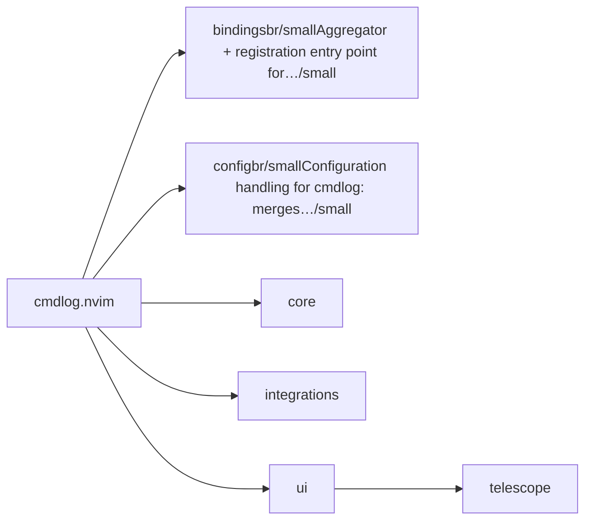

# cmdlog.nvim — module map

> **Generated** by `documentation`. Do not edit by hand — run `:DocMap`
> (or `nvim --headless -l scripts/gen_map.lua`) to regenerate.

**3 modules** · 4 namespaces · 36 helper files

The [interactive map](index.html) has filtering, full descriptions and
source links; this page is the version the code host renders directly.

## Namespaces

## Dependencies

Which parts of the tree require which, rolled up to the second level.
The [interactive map](index.html)'s **Deps** view has this per module,
in both directions, with load-time and lazy requires told apart.

```mermaid
flowchart LR
  nlua_cmdlog_bindings_keymaps_lua["cmdlog.bindings.keymaps"]
  nlua_cmdlog_bindings_usrcmds_lua["cmdlog.bindings.usrcmds"]
  nlua_cmdlog_core_errors_lua["cmdlog.core.errors"]
  nlua_cmdlog_core_extra_files_lua["cmdlog.core.extra_files"]
  nlua_cmdlog_core_favorites_lua["cmdlog.core.favorites"]
  nlua_cmdlog_core_history_lua["cmdlog.core.history"]
  nlua_cmdlog_core_notes_lua["cmdlog.core.notes"]
  nlua_cmdlog_core_project_history_lua["cmdlog.core.project_history"]
  nlua_cmdlog_core_risky_lua["cmdlog.core.risky"]
  nlua_cmdlog_core_shell_lua["cmdlog.core.shell"]
  nlua_cmdlog_core_stats_lua["cmdlog.core.stats"]
  nlua_cmdlog_core_store_lua["cmdlog.core.store"]
  nlua_cmdlog_core_tags_lua["cmdlog.core.tags"]
  nlua_cmdlog_core_tracker_lua["cmdlog.core.tracker"]
  nlua_cmdlog_core_utils_lua["cmdlog.core.utils"]
  nlua_cmdlog_integrations_which_key_lua["cmdlog.integrations.which_key"]
  nlua_cmdlog_ui_all_picker_lua["cmdlog.ui.all_picker"]
  nlua_cmdlog_ui_all_unique_picker_lua["cmdlog.ui.all_unique_picker"]
  nlua_cmdlog_ui_cycle_lua["cmdlog.ui.cycle"]
  nlua_cmdlog_ui_favorites_picker_lua["cmdlog.ui.favorites_picker"]
  nlua_cmdlog_ui_fzf_previewer_lua["cmdlog.ui.fzf-previewer"]
  nlua_cmdlog_ui_history_picker_lua["cmdlog.ui.history_picker"]
  nlua_cmdlog_ui_history_unique_picker_lua["cmdlog.ui.history_unique_picker"]
  nlua_cmdlog_ui_lua_picker_lua["cmdlog.ui.lua_picker"]
  nlua_cmdlog_ui_mappings_lua["cmdlog.ui.mappings"]
  nlua_cmdlog_ui_picker_utils_lua["cmdlog.ui.picker_utils"]
  nlua_cmdlog_ui_project_picker_lua["cmdlog.ui.project_picker"]
  nlua_cmdlog_ui_shell_picker_lua["cmdlog.ui.shell_picker"]
  nlua_cmdlog_ui_shell_unique_picker_lua["cmdlog.ui.shell_unique_picker"]
  nlua_cmdlog_ui_stats_picker_lua["cmdlog.ui.stats_picker"]
  nlua_cmdlog_ui_telescope["telescope"]
  nlua_cmdlog_ui_telescope_previewer_lua["cmdlog.ui.telescope-previewer"]
  nlua_cmdlog_bindings_keymaps_lua --> nlua_cmdlog_bindings_usrcmds_lua
  nlua_cmdlog_bindings_usrcmds_lua --> nlua_cmdlog_core_favorites_lua
  nlua_cmdlog_core_errors_lua --> nlua_cmdlog_core_store_lua
  nlua_cmdlog_core_project_history_lua --> nlua_cmdlog_core_store_lua
  nlua_cmdlog_core_stats_lua --> nlua_cmdlog_core_store_lua
  nlua_cmdlog_core_tags_lua --> nlua_cmdlog_core_store_lua
  nlua_cmdlog_core_tracker_lua --> nlua_cmdlog_core_errors_lua
  nlua_cmdlog_core_tracker_lua --> nlua_cmdlog_core_project_history_lua
  nlua_cmdlog_core_tracker_lua --> nlua_cmdlog_core_stats_lua
  nlua_cmdlog_integrations_which_key_lua --> nlua_cmdlog_bindings_keymaps_lua
  nlua_cmdlog_ui_all_picker_lua --> nlua_cmdlog_core_extra_files_lua
  nlua_cmdlog_ui_all_picker_lua --> nlua_cmdlog_core_favorites_lua
  nlua_cmdlog_ui_all_picker_lua --> nlua_cmdlog_core_history_lua
  nlua_cmdlog_ui_all_picker_lua --> nlua_cmdlog_core_shell_lua
  nlua_cmdlog_ui_all_picker_lua --> nlua_cmdlog_core_utils_lua
  nlua_cmdlog_ui_all_picker_lua --> nlua_cmdlog_ui_mappings_lua
  nlua_cmdlog_ui_all_picker_lua --> nlua_cmdlog_ui_picker_utils_lua
  nlua_cmdlog_ui_all_unique_picker_lua --> nlua_cmdlog_core_extra_files_lua
  nlua_cmdlog_ui_all_unique_picker_lua --> nlua_cmdlog_core_favorites_lua
  nlua_cmdlog_ui_all_unique_picker_lua --> nlua_cmdlog_core_history_lua
  nlua_cmdlog_ui_all_unique_picker_lua --> nlua_cmdlog_core_shell_lua
  nlua_cmdlog_ui_all_unique_picker_lua --> nlua_cmdlog_core_utils_lua
  nlua_cmdlog_ui_all_unique_picker_lua --> nlua_cmdlog_ui_mappings_lua
  nlua_cmdlog_ui_all_unique_picker_lua --> nlua_cmdlog_ui_picker_utils_lua
  nlua_cmdlog_ui_cycle_lua --> nlua_cmdlog_ui_favorites_picker_lua
  nlua_cmdlog_ui_cycle_lua --> nlua_cmdlog_ui_history_unique_picker_lua
  nlua_cmdlog_ui_cycle_lua --> nlua_cmdlog_ui_project_picker_lua
  nlua_cmdlog_ui_cycle_lua --> nlua_cmdlog_ui_shell_unique_picker_lua
  nlua_cmdlog_ui_favorites_picker_lua --> nlua_cmdlog_core_favorites_lua
  nlua_cmdlog_ui_favorites_picker_lua --> nlua_cmdlog_core_tags_lua
  nlua_cmdlog_ui_favorites_picker_lua --> nlua_cmdlog_ui_cycle_lua
  nlua_cmdlog_ui_favorites_picker_lua --> nlua_cmdlog_ui_mappings_lua
  nlua_cmdlog_ui_favorites_picker_lua --> nlua_cmdlog_ui_picker_utils_lua
  nlua_cmdlog_ui_history_picker_lua --> nlua_cmdlog_core_extra_files_lua
  nlua_cmdlog_ui_history_picker_lua --> nlua_cmdlog_core_favorites_lua
  nlua_cmdlog_ui_history_picker_lua --> nlua_cmdlog_core_history_lua
  nlua_cmdlog_ui_history_picker_lua --> nlua_cmdlog_core_utils_lua
  nlua_cmdlog_ui_history_picker_lua --> nlua_cmdlog_ui_mappings_lua
  nlua_cmdlog_ui_history_picker_lua --> nlua_cmdlog_ui_picker_utils_lua
  nlua_cmdlog_ui_history_unique_picker_lua --> nlua_cmdlog_core_extra_files_lua
  nlua_cmdlog_ui_history_unique_picker_lua --> nlua_cmdlog_core_favorites_lua
  nlua_cmdlog_ui_history_unique_picker_lua --> nlua_cmdlog_core_history_lua
  nlua_cmdlog_ui_history_unique_picker_lua --> nlua_cmdlog_core_utils_lua
  nlua_cmdlog_ui_history_unique_picker_lua --> nlua_cmdlog_ui_cycle_lua
  nlua_cmdlog_ui_history_unique_picker_lua --> nlua_cmdlog_ui_mappings_lua
  nlua_cmdlog_ui_history_unique_picker_lua --> nlua_cmdlog_ui_picker_utils_lua
  nlua_cmdlog_ui_lua_picker_lua --> nlua_cmdlog_core_favorites_lua
  nlua_cmdlog_ui_lua_picker_lua --> nlua_cmdlog_core_history_lua
  nlua_cmdlog_ui_lua_picker_lua --> nlua_cmdlog_core_utils_lua
  nlua_cmdlog_ui_lua_picker_lua --> nlua_cmdlog_ui_mappings_lua
  nlua_cmdlog_ui_lua_picker_lua --> nlua_cmdlog_ui_picker_utils_lua
  nlua_cmdlog_ui_mappings_lua --> nlua_cmdlog_core_favorites_lua
  nlua_cmdlog_ui_mappings_lua --> nlua_cmdlog_core_tags_lua
  nlua_cmdlog_ui_picker_utils_lua --> nlua_cmdlog_core_errors_lua
  nlua_cmdlog_ui_picker_utils_lua --> nlua_cmdlog_core_notes_lua
  nlua_cmdlog_ui_picker_utils_lua --> nlua_cmdlog_core_risky_lua
  nlua_cmdlog_ui_picker_utils_lua --> nlua_cmdlog_ui_fzf_previewer_lua
  nlua_cmdlog_ui_picker_utils_lua --> nlua_cmdlog_ui_telescope_previewer_lua
  nlua_cmdlog_ui_project_picker_lua --> nlua_cmdlog_core_favorites_lua
  nlua_cmdlog_ui_project_picker_lua --> nlua_cmdlog_core_project_history_lua
  nlua_cmdlog_ui_project_picker_lua --> nlua_cmdlog_core_utils_lua
  nlua_cmdlog_ui_project_picker_lua --> nlua_cmdlog_ui_cycle_lua
  nlua_cmdlog_ui_project_picker_lua --> nlua_cmdlog_ui_mappings_lua
  nlua_cmdlog_ui_project_picker_lua --> nlua_cmdlog_ui_picker_utils_lua
  nlua_cmdlog_ui_shell_picker_lua --> nlua_cmdlog_core_favorites_lua
  nlua_cmdlog_ui_shell_picker_lua --> nlua_cmdlog_core_shell_lua
  nlua_cmdlog_ui_shell_picker_lua --> nlua_cmdlog_core_utils_lua
  nlua_cmdlog_ui_shell_picker_lua --> nlua_cmdlog_ui_mappings_lua
  nlua_cmdlog_ui_shell_picker_lua --> nlua_cmdlog_ui_picker_utils_lua
  nlua_cmdlog_ui_shell_unique_picker_lua --> nlua_cmdlog_core_favorites_lua
  nlua_cmdlog_ui_shell_unique_picker_lua --> nlua_cmdlog_core_shell_lua
  nlua_cmdlog_ui_shell_unique_picker_lua --> nlua_cmdlog_core_utils_lua
  nlua_cmdlog_ui_shell_unique_picker_lua --> nlua_cmdlog_ui_cycle_lua
  nlua_cmdlog_ui_shell_unique_picker_lua --> nlua_cmdlog_ui_mappings_lua
  nlua_cmdlog_ui_shell_unique_picker_lua --> nlua_cmdlog_ui_picker_utils_lua
  nlua_cmdlog_ui_stats_picker_lua --> nlua_cmdlog_core_favorites_lua
  nlua_cmdlog_ui_stats_picker_lua --> nlua_cmdlog_core_stats_lua
  nlua_cmdlog_ui_stats_picker_lua --> nlua_cmdlog_ui_mappings_lua
  nlua_cmdlog_ui_stats_picker_lua --> nlua_cmdlog_ui_picker_utils_lua
  nlua_cmdlog_ui_telescope --> nlua_cmdlog_core_notes_lua
  nlua_cmdlog_ui_telescope --> nlua_cmdlog_ui_picker_utils_lua
```

## Modules

| Module | Description | Fns | Docs |
|---|---|---|---|
| `cmdlog.bindings` | Aggregator + registration entry point for every command/keymap cmdlog owns. |  | [src](../../lua/cmdlog/bindings/init.lua) |
| `cmdlog.config` | Configuration handling for cmdlog: merges user options with DEFAULTS and exposes the result as `M.options`. |  | [src](../../lua/cmdlog/config/init.lua) |
| `core` |  |  |  |
| `integrations` |  |  |  |
| `ui` |  |  |  |
| &nbsp;&nbsp;`telescope` |  |  |  |

## Drift

0 errors · 5 warnings · 11 info

| Severity | Check | Message |
|---|---|---|
| warn | `require-cycle` | require cycle across 5 modules: cmdlog.ui.cycle → cmdlog.ui.favorites_picker → cmdlog.ui.history_unique_picker → cmdlog.ui.project_picker → cmdlog.ui.shell_unique_picker |
| warn | `require-cycle` | require cycle across 5 modules: cmdlog.ui.cycle → cmdlog.ui.favorites_picker → cmdlog.ui.history_unique_picker → cmdlog.ui.project_picker → cmdlog.ui.shell_unique_picker |
| warn | `require-cycle` | require cycle across 5 modules: cmdlog.ui.cycle → cmdlog.ui.favorites_picker → cmdlog.ui.history_unique_picker → cmdlog.ui.project_picker → cmdlog.ui.shell_unique_picker |
| warn | `require-cycle` | require cycle across 5 modules: cmdlog.ui.cycle → cmdlog.ui.favorites_picker → cmdlog.ui.history_unique_picker → cmdlog.ui.project_picker → cmdlog.ui.shell_unique_picker |
| warn | `require-cycle` | require cycle across 5 modules: cmdlog.ui.cycle → cmdlog.ui.favorites_picker → cmdlog.ui.history_unique_picker → cmdlog.ui.project_picker → cmdlog.ui.shell_unique_picker |

11 informational findings

| Check | Message |
|---|---|
| `missing-readme` | lua/cmdlog has no README.md |
| `missing-readme` | lua/cmdlog/bindings has no README.md |
| `missing-readme` | lua/cmdlog/config has no README.md |
| `unreferenced-module` | cmdlog.health is required by no other file in the tree |
| `unreferenced-module` | cmdlog.ui.all_picker is required by no other file in the tree |
| `unreferenced-module` | cmdlog.ui.all_unique_picker is required by no other file in the tree |
| `unreferenced-module` | cmdlog.ui.history_picker is required by no other file in the tree |
| `unreferenced-module` | cmdlog.ui.lua_picker is required by no other file in the tree |
| `unreferenced-module` | cmdlog.ui.shell_picker is required by no other file in the tree |
| `unreferenced-module` | cmdlog.ui.stats_picker is required by no other file in the tree |
| `unreferenced-module` | cmdlog.ui.telescope.notes_picker is required by no other file in the tree |

