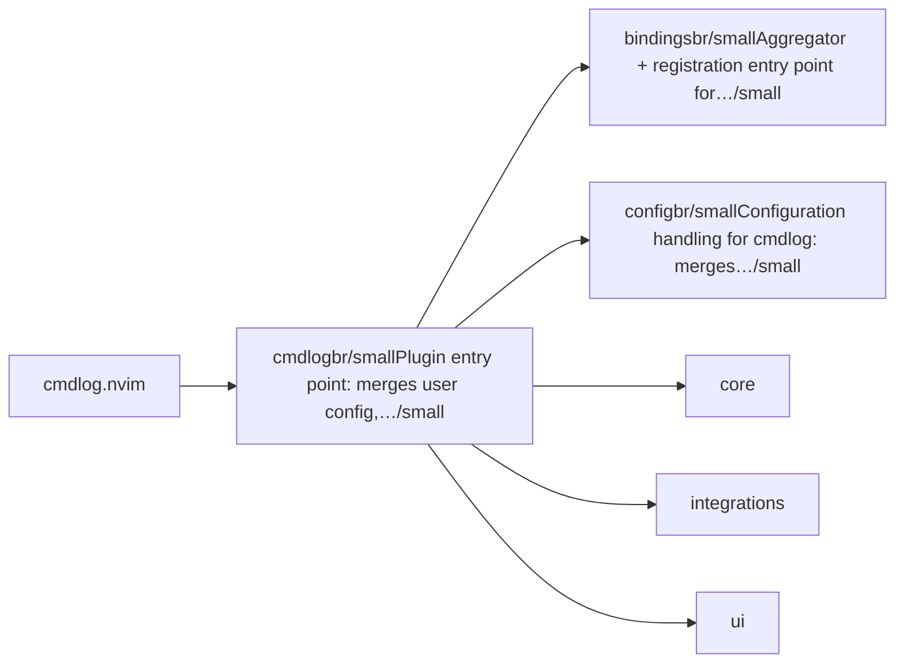
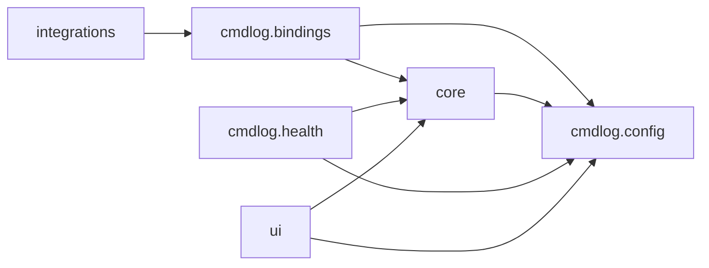

# cmdlog.nvim — module map

> **Generated** by `documentation`. Do not edit by hand — run `:DocMap`
> (or `nvim --headless -l scripts/gen_map.lua`) to regenerate.

**3 modules** · 5 namespaces · 36 helper files

The [interactive map](index.html) has filtering, full descriptions and
source links; this page is the version the code host renders directly.

## Namespaces

## Dependencies

Which parts of the tree require which, rolled up to the second level.
The [interactive map](index.html)'s **Deps** view has this per module,
in both directions, with load-time and lazy requires told apart.

## Modules

| Module | Description | Fns | Docs |
|---|---|---|---|
| `cmdlog` | Plugin entry point: merges user config, registers bindings, starts the command tracker and wires up optional which-key integration. | 1 | [src](../../lua/cmdlog/init.lua) |
| &nbsp;&nbsp;`cmdlog.bindings` | Aggregator + registration entry point for every command/keymap cmdlog owns. | 2 | [src](../../lua/cmdlog/bindings/init.lua) |
| &nbsp;&nbsp;`cmdlog.config` | Configuration handling for cmdlog: merges user options with DEFAULTS and exposes the result as `M.options`. | 1 | [src](../../lua/cmdlog/config/init.lua) |
| &nbsp;&nbsp;`core` |  |  |  |
| &nbsp;&nbsp;`integrations` |  |  |  |
| &nbsp;&nbsp;`ui` |  |  |  |
| &nbsp;&nbsp;&nbsp;&nbsp;`telescope` |  |  |  |

## Drift

0 errors · 1 warnings · 28 info

| Severity | Check | Message |
|---|---|---|
| warn | `type-vs-class` | module table annotated ---@type { name: string, show: fun(initial_text: string\|nil) }[], but 1 field(s) are assigned to it — LuaLS reports missing-fields/"fields cannot be injected" for this shape; use ---@class instead (---@class cmdlog.ui.cycle : { name: string, show: fun(initial_text: string\|nil) }[], plus @see the type definition, if { name: string, show: fun(initial_text: string\|nil) }[] should still be checked against it) |

28 informational findings

| Check | Message |
|---|---|
| `missing-readme` | lua/cmdlog has no README.md |
| `missing-readme` | lua/cmdlog/bindings has no README.md |
| `missing-readme` | lua/cmdlog/config has no README.md |
| `undocumented-param` | M.setup has 1 parameter(s) but only 0 @param line(s) |
| `undocumented-param` | M.toggle has 1 parameter(s) but only 0 @param line(s) |
| `undocumented-param` | M.move has 2 parameter(s) but only 0 @param line(s) |
| `undocumented-param` | M.export has 1 parameter(s) but only 0 @param line(s) |
| `undocumented-param` | M.is_favorite has 1 parameter(s) but only 0 @param line(s) |
| `undocumented-param` | M.import has 1 parameter(s) but only 0 @param line(s) |
| `undocumented-param` | M.save has 1 parameter(s) but only 0 @param line(s) |
| `undocumented-param` | M.is_risky has 1 parameter(s) but only 0 @param line(s) |
| `undocumented-param` | M.process_list has 2 parameter(s) but only 0 @param line(s) |
| `undocumented-param` | M.deduplicate_list has 1 parameter(s) but only 0 @param line(s) |
| `undocumented-param` | M.reverse_list has 1 parameter(s) but only 0 @param line(s) |
| `undocumented-param` | M.show_favorites_picker has 1 parameter(s) but only 0 @param line(s) |
| `undocumented-param` | M.show_history_unique_picker has 1 parameter(s) but only 0 @param line(s) |
| `undocumented-param` | M.open_picker has 3 parameter(s) but only 0 @param line(s) |
| `undocumented-param` | M.show_project_picker has 1 parameter(s) but only 0 @param line(s) |
| `undocumented-param` | M.show_shell_unique_picker has 1 parameter(s) but only 0 @param line(s) |
| `unreferenced-module` | cmdlog is required by no other file in the tree |
| `unreferenced-module` | cmdlog.health is required by no other file in the tree |
| `unreferenced-module` | cmdlog.ui.all_picker is required by no other file in the tree |
| `unreferenced-module` | cmdlog.ui.all_unique_picker is required by no other file in the tree |
| `unreferenced-module` | cmdlog.ui.history_picker is required by no other file in the tree |
| `unreferenced-module` | cmdlog.ui.lua_picker is required by no other file in the tree |
| `unreferenced-module` | cmdlog.ui.shell_picker is required by no other file in the tree |
| `unreferenced-module` | cmdlog.ui.stats_picker is required by no other file in the tree |
| `unreferenced-module` | cmdlog.ui.telescope.notes_picker is required by no other file in the tree |

